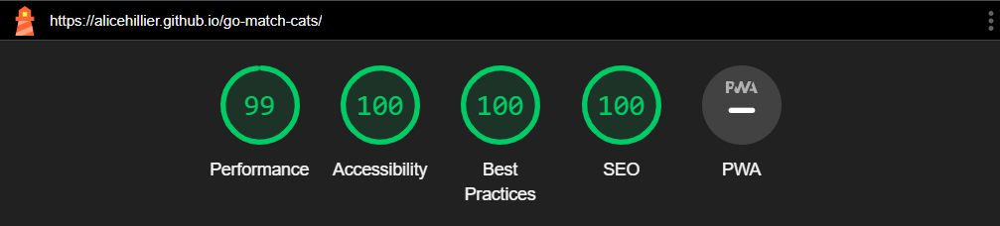
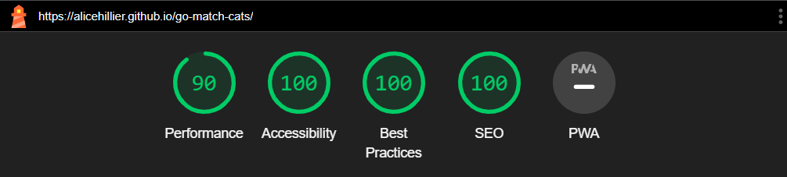

# **Go-Match! Cats - Testing**

[Go back to the README index](https://github.com/alicehillier/rainforest-cafe#go-match-cats)

[Go back to the Testing section of the README](https://github.com/alicehillier/go-match-cats#testing)

[Visit my website here](https://alicehillier.github.io/go-match-cats)

## **User Stories**

#### **First-Time Visitor Goal**

1. I want to read instructions about how to play the game.
    - Instructions about how to play the game can be found by clicking on the 'HELP' button in the header.

2. I want to be able to restart the game before the round is over.
    - While a game is in progress, a 'QUIT' button will appear in the header. When clicked, the game will restart and allow the player to select a different difficulty level.

3. I want to see colourful, visually-appealing images.
    - The background colours are bright, with a mix of blue and pink. The cartoon cat image is used regularly on larger screens, appearing in the title bar, as an animation at the bottom of the screen, in the leaderboard and instructions. On small screens, the cat animation can be seen in the header instead of the page title.

4. I want to be able to view the cards when I flip them.
    - Once two cards have been flipped, if they do not match, there is a one-second delay before the cards flip back over, allowing the player to view the images.

5. I want to know how much time I have to complete the game.
    - Once a game has begun, the timer in the top left corner starts the countdown, allowing the player to see how much time they have remaining to complete the game.

#### **Returning Visitor Goal**

1. I want to see what my score was last time (and see if I can do better this time).
    - Players can access the leaderboard before a game begins and after a game finishes. As the score is stored in local storage after every game, players can access their top scores beyond this session.
    If players share a device, they can enter their names at the beginning of the session to ensure that they can identify their own scores.

2. I want the cards to change positions every time I play.
    - The cards are shuffled before every game begins, ensuring a different experience every time. By adding some unpredictability, the game becomes more re-playable and enjoyable for the player.

#### **Frequent Visitor Goal**

1. I want to see what my best score was and how my scores compare with others.
    - Players can access the leaderboard before a game begins and after a game finishes. Players can enter their name at the beginning of the session, which will appear on the leaderboard. The leaderboard uses data stored in local storage, so in order to view others' scores, players must use the same device.

3. I want more levels to play.
    - Players can play the game on easy, normal or hard mode, which enables them to experience a new challenge every time. While new levels are not available at the moment, additional themes could be introduced in future.

4. I want to choose the level of difficulty.
    - Players can play the game on easy, normal or hard mode. Each mode offers a different number of cards, offering a greater challenge for players if they desire. Easy and normal mode have a time limit set at 30 seconds, while hard mode has a time limit set at 60 seconds. While it is more challenging, it is still possible to win with the additional time.

## **Manual Testing**

### **Homepage Responsive Design Testing**

The website has been designed to be responsive using media queries. Below are examples of the website's appearance on various devices.

iPhone SE

iPhone XR

iPhone 12 Pro

Google Pixel 5

Samsung Galaxy S8+

Samsung Galaxy S20 Ultra

iPad Mini

iPad Air

## **Validation and Lighthouse**

### **W3C HTML Validation**

See the full results page [here](assets/images/readme-images/testing/html-validation.pdf).

### **Jigsaw CSS Validation**

See the full results page [here](assets/images/readme-images/testing/css-validation.pdf).

### **JSHint JavaScript Validation**

### **Lighthouse Testing**

#### **Go-Match! Cats on Desktop**

See the full results page [here](assets/images/readme-images/testing/testing-lighthouse-desktop-results.pdf).

#### **Go-Match! Cats on Mobile**

See the full results page [here](assets/images/readme-images/testing/testing-lighthouse-mobile-results.pdf).

## **User Testing**

1. Another suggestion was to include instructions for the game, so players new to the concept can quickly pick up the rules and understand what the objective is.
    - To implement this, I created a 'leaderboard' button, which displays in the header alongside other information relevant to the game. When the player clicks on the 'instructions' button, a set of instructions appears as an overlay, taking up the full height and width of the viewport. The instructions are easy to exit, with a conventional 'X' in the top right corner. By displaying the instructions as an overlay, the main page remains active, meaning that there is no need to re-load or refresh the page. This is more efficient and user-friendly.

2. My mentor recommended that the instructions and leaderboard should not be accessible while the game is being played as it could be distracting. 
    - I took my mentor's advice and reduced the opacity of the instructions and leaderboard buttons, giving them a darker appearance. I also set their cursor to 'not-allowed', so the user knows that the button is not intended to be interacted with at that time. Once a game has finished, the buttons can be clicked on.

3. My mentor also recommended only having the 'quit' button appear while a game is in progress.
    - I set the visibility of the element to 'visible' when the startTimer function runs, and changed the visibility to 'hidden' when the player wins, loses or quits the game. 

4. During testing, my husband found the header a little confusing as the elements on the left had the same appearance as the buttons on the right. He suggested that the elements on the left should have a different appearance so they don't look like buttons.
    - I removed the background-colour and border, leaving only the text, as the content was display only. I also used white for the text, while the buttons have a white background with dark blue text. This helps the user to differentiate the items in the header and gives a clearer indication of which ones can be interacted with.

## **Further Testing**

This website was tested on a variety of devices, including Windows laptops, iPhone 12 Mini and iPad Air. It was also tested on different browsers, including Google Chrome and Safari (iOS).